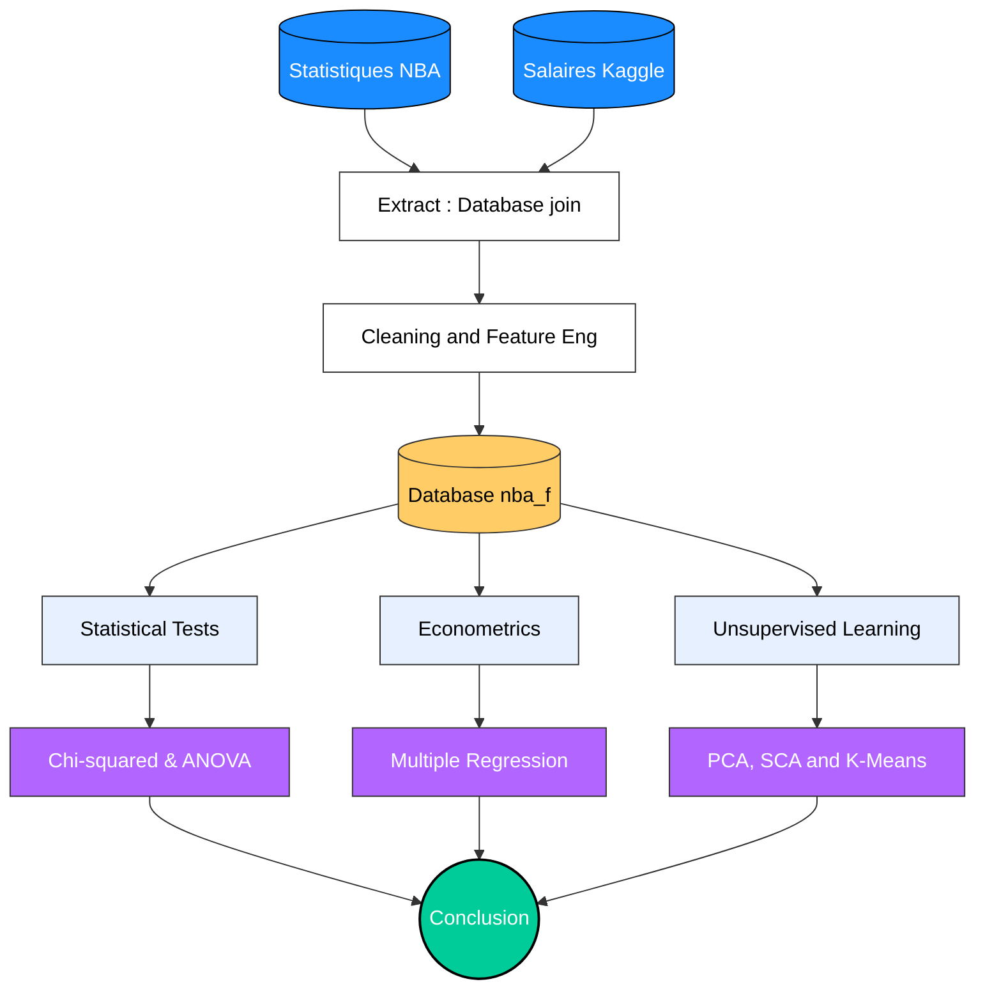

# Econometrics Project : Analysis of the Relationship Between Performance and Salaries in the NBA During the 2024–2025 Season

## 📌 Project Overview
This project was developed as part of a Data Science / Econometrics course. The main goal is to analyze a real-world NBA dataset to answer the following question: **Do statistics truly reflect the value (salary) of an NBA player?**

As huge NBA fans ourselves, we will try to demonstrate here that the league operates on two parallel economies: while statistics perfectly explain the salaries of rotation players, other factors (status, experience) take over for the superstars.

## 🏗️ Overall Architecture

*(Overview of the data structure, ETL flow and analysis process)*

## 🎯 Objectives and Statistical Methods
This project showcases the mastery of an end-to-end Data Science pipeline in **R**, from data cleaning to advanced mathematical modeling. 

The following methods were implemented and interpreted:
* **Univariate Analysis:** Study of the distributions (histograms, boxplots, outliers) of salaries and player origins.
* **Bivariate Analysis & Hypothesis Testing:** * Correlation and Multiple Linear Regression (Salary ~ Performance + Age + Availability) with residual analysis (normality, homoscedasticity).
  * Monte-Carlo simulated Chi-Squared Test.
  * Analysis of Variance (ANOVA).
* **Dimensionality Reduction:** Principal Component Analysis (PCA) to identify playing profiles.
* **Machine Learning (Unsupervised):** Hierarchical Agglomerative Clustering (HAC) and K-Means Algorithm to segment the league into distinct player profile clusters.

## 🛠️ Technologies Used
* **Language:** R
* **Environment:** RStudio / R Markdown (Automated PDF report generation).
* **Core Packages:** `tidyverse` (data manipulation), `ggplot2` (dataviz), `factoextra` (clustering), `broom` and `vtable` (statistical formatting).

## 📂 Repository Structure
* `Projet_Econometrie_Remy_Enzo24.Rmd`: The source script containing all the fully commented code.
* `Projet_Sans_Code.pdf`: The final report generated, fully formatted and interpreted, without displaying the code.
* `base_stats_NBA_24_25.csv` & `NBA Player Salaries_2024-25_1.csv`: The raw datasets (official NBA statistics and Kaggle salaries).

## 🚀 How to Reproduce the Analysis?
1. Clone this repository to your local machine.
2. Make sure you have R and RStudio installed.
3. Open the `.Rmd` file. The `pacman` package will automatically install and load the required dependencies.
4. To generate the PDF reports, run the following commands directly in the R **Console**, depending on whether you want to show or hide the source code:
   * With the code : rmarkdown::render("Projet_Econometrie_Remy_Enzo24.Rmd", params = list(afficher_code = TRUE), output_file = "Projet_Avec_Code.pdf")
   * Without : rmarkdown::render("Projet_Econometrie_Remy_Enzo24.Rmd", params = list(afficher_code = FALSE), output_file = "Projet_Sans_Code.pdf")
 
##

### 🌍 Note : The final PDF report `Projet_Sans_Code.pdf` is written in French. However, I would be more than happy to discuss the methodology, the code, or the results in English! Feel free to reach out.
